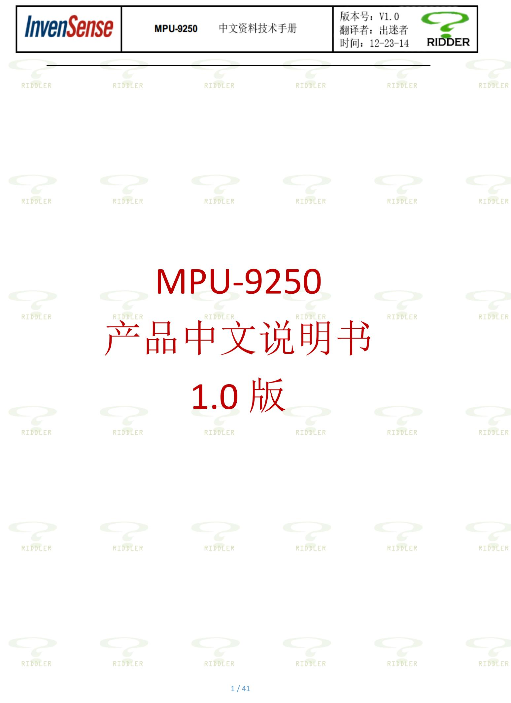

目录
1. 产品信息....4
1.1 版本历史....4
? 翻译者的话....4
1.2 文档说明....5
1.3 产品概述....5
1.4 应用领域....5
2 特性....6
2.1 陀螺仪特性....6
2.2 加速度特性....6
2.3 电子罗盘特性....6
2.4 其他特性....7
2.5 应用建议....7
3 电气特性....8
3.1 陀螺仪参数....8
3.2 加速度参数....9
3.3 磁力计参数....10
3.4 电气特性....11
3.4.1 D.C.电气特性....11
3.4.2 A.C.电气特性....12
3.4.3 其他特性....14
3.5 I2C 时序特性....15
3.6 SPI 时序特性....16
4 使用说明....19
4.1 引脚功能说明....19
4.2 典型电路....20
4.3 周围电路元器件清单....20
4.4 内部框图....21
4.5 概述....22
4.6 16 位 ADC 三轴陀螺仪信号输出及调理....22
4.7 16 位 ADC 三轴加速度信号输出及调理....22
4.8 16 位 ADC 三轴磁力计信号输出及调理....22
4.9 运动数字处理引擎（DMP）....23
4.10 主 I2C 及 SPI 通信....23
4.11 辅助 I2C 芯片通讯....23
4.12 自检模式....24
4.13 MPU-250 I2C 通信解决方案....25
4.14 MPU-9250 SPI 通信解决方案....26
4.15 时钟方案....26
4.16 数据寄存器....27
4.17 FIFO 数据缓存区....27
4.18 中断功能....27

4.19 温度数字输出....28
4.20 稳压偏置....28
4.21 电荷泵....28
4.22 标准供能方案....28
4.23 电源和复位规则....28
5 硬件新技术....29
6 可编程中断....30
6.1 运动唤醒中断....30
7 数字接口....32
7.1 I2C 和 SPI 接口....32
7.2 I2C 通信....32
7.3 I2C 通信协议....32
7.4 I2C 符号说明....34
7.5 SPI 通讯协议....35
8 串行接口....36
8.1 I2C 使用方案....36
9 封装....37
9.1 轴定位....37
10 封装号....39
11 产品测试....40
11.1 质量测试标准....40
11.2 测试方案....40
12 参考说明....41

<table><tr><td>InvenSense</td><td>MPU-9250</td><td>中文资料技术手册</td><td>版本号:V1.0翻译者:出迷者时间:12-23-14</td><td>RIDDER</td></tr></table>

## 1.产品信息

## 1.1 版本历史

<table><tr><td>时间</td><td>版本</td><td>描述</td></tr><tr><td>12/23/14</td><td>1.0</td><td>首款 9 轴中文资料 V1.0 版,翻译 V1.0 版 MPU9250 英文资料,造福广大 9 轴中文开发及爱好者</td></tr></table>

## ? 翻译者的话

本次的翻译为 V1.0 翻译第一版，可能某些地方翻译不是很准确。如果您有疑议，请发意见或建议至 rminaterfxy @hotmail.com或者在新浪微博私信出迷者。本人将做不定期的更新。如果有新版本放出，将通过微博通知，其他方式赎不通知。感谢支持。

说明：与此文档配套的还有 MPU-9250 寄存器手册中文版。

## 1.2 文档说明

本说明书只提供基础的产品设计及规格设计的信息。本芯片采用QFN 封装，封装大小只有 3XX1mm。

若产品规格发生改变，恕不另行通知。最终效果取决于产品特性。若想查看寄存器，请查阅寄存器文档。

## 1.3 产品概述

MPU9250 是一个 QFN 封装的复合芯片（MCM），它由 2 部分组成。一组是 3 轴加速度还有3轴陀螺仪，另一组则是 AKM公司的 AK8963 3轴磁力计。所以，MPU9250是一款9轴运动跟踪装置，他在小小的 3X3X1mm 的封装中融合了 3 轴加速度，3 轴陀螺仪以及数字运动处理器（DMP）并且兼容MPU6515。其完美的I2C方案，可直接输出9轴的全部数据。一体化的设计，运动性的融合，时钟校准功能，让开发者避开了繁琐复杂的芯片选择和外设成本，保证最佳的性能。本芯片也为兼容其它传感器开放了辅助 I2C接口，比如连接压力传感器。

MPU9250 的具有三个 16位加速度AD 输出，三个 16 位陀螺仪 AD输出，三个 6位磁力计 AD 输出。精密的慢速和快速运动跟踪，提供给客户全量程的可编程陀螺仪参数选择（±250，±500，±1000，and±2000 °/秒（dps）），可编程的加速度参数选择±2g，±4g，±8g，±16g，以及最大磁力计可达到±4800uT。

其他业界领先的功能还有可编程的数字滤波器，40-85℃时带高精度的 1%的时钟漂移，嵌入了温度传感器，并且带有可编程中断。该装置提供 I2C和 SPI的接口，2.4-3.6V的供电电压，还有单独的数字 IO 口，支持 1.71V 到 VDD。

通信采用 400KHz 的 I2C 和 1MHz 的 SPI，若需要更快的速度，可以用 SPI 在 20MHz 的RIDDLER RIDDLER模式下直接读取传感器和中断寄存器。

采用CMOS-MEMS的制作平台，让传感器以低成本的高性能集成在一个 3x3x1mm的芯片内，并且能承受住 10，000g的震动冲击。

## 1.4 应用领域

中文资料技术手册

版本号：V1.0

## 2 特性

## 2.1陀螺仪特性

三轴陀螺仪的特性：

用户可编量程（±250，±500，±1000 度/秒）三轴（x，y，z）16 位 ADC 角速度数字输出可编程数字低通滤波陀螺仪工作电流：3.2mA休眠模式电流：8uA出厂灵敏度校准自我检测

## 2.2 加速度特性

三轴加速度计的特性：

用户可编量程（±2g，±4g，±8g，±16g）三轴 16 位 ADC 加速度数字输出

低功耗模式电流：0.98Hz---8.4uA 31.25Hz----19.8uA

休眠模式电流：8uA

用户可编程中断

运动中断唤醒功能

## 2.3 电子罗盘特性

磁场计的特性：

3轴单片霍尔传感器

大量程低功耗高精度

14 位（0.6uT/LSB）和 16 位（15uT/LSB）的分辨率输出

最大±4800uT 的测量范围

磁力计的正常工作电流：280uA—8Hz

内部自我检测功能

MPU-9250

中文资料技术手册

版本号：V1.0

翻译者：出迷者

时间：12-23-14

## 2.4 其他特性

MPU250 包含以下的额外特性:

辅助I2C 总线可读外部其他传感器（比如读取气压传感器）

9 轴和 DMP 开始工作时耗电 3.5mA

VDD 供能电压范围 2.4-3.6V

VDDIO为辅助I2C 设备提供参考电压

目前最薄最小 QEN 设备：3x3x1mm

最小的9 轴交叉轴传感器

512字节的FIFO数据缓冲区

数字温度传感器

可编程的数字滤波器

10，000g 防震

全寄存器I2C通信最快达到 400KHz

全寄存器SPI通讯达到1MHz

20MHz 的SPI读取速度并带中断寄存器

MEMS结构晶圆级密封

符合RoHS绿色环保要求

## 2.5 应用建议

内部自带的运动处理器可以做运动处理。可编程中断可以用来做低功耗的手势识别。

可以单独开启低功耗 DMP记步器而让主机休眠。

<table><tr><td>InvenSense</td><td>MPU-9250</td><td>中文资料技术手册</td><td>版本号:V1.0翻译者:出迷者时间:12-23-14</td><td>RIDDER</td></tr></table>

## 3 电气特性

## 3.1陀螺仪参数

典型工作电路请参阅 4.2 章节，VDD =2.5V， VDDIO=2.5V，TA=25℃，除非另外说明。

<table><tr><td>参数</td><td>条件</td><td>最小值</td><td>典型值</td><td>最大值</td><td>单位</td></tr><tr><td>全部量程</td><td>FS_SEL=0</td><td></td><td>±250</td><td></td><td>o/s</td></tr><tr><td></td><td>FS_SEL=1</td><td></td><td>±500</td><td></td><td>o/s</td></tr><tr><td></td><td>FS_SEL=2</td><td></td><td>±1000</td><td></td><td>o/s</td></tr><tr><td></td><td>FS_SEL=3</td><td></td><td>±2000</td><td></td><td>o/s</td></tr><tr><td>陀螺仪字长</td><td></td><td></td><td>16</td><td></td><td>Bits</td></tr><tr><td>灵敏度</td><td>FS_SEL=0</td><td></td><td>131</td><td></td><td>LSB/(o/s)</td></tr><tr><td></td><td>FS_SEL=1</td><td></td><td>65.5</td><td></td><td>LSB/(o/s)</td></tr><tr><td></td><td>FS_SEL=2</td><td></td><td>32.8</td><td></td><td>LSB/(o/s)</td></tr><tr><td></td><td>FS_SEL=3</td><td></td><td>16.4</td><td></td><td>LSB/(o/s)</td></tr><tr><td>灵敏度测试温度</td><td>25°C</td><td></td><td>±3</td><td></td><td>%</td></tr><tr><td>灵敏度适用温度范围</td><td>-40°C---+85°C</td><td></td><td>±4</td><td></td><td>%</td></tr><tr><td>非线性</td><td>25°C时最接近直线</td><td></td><td>±0.1</td><td></td><td>%</td></tr><tr><td>交叉轴灵敏度</td><td></td><td></td><td>±2</td><td></td><td>%</td></tr><tr><td>ZEO差</td><td>25°C</td><td></td><td>±5</td><td></td><td>o/s</td></tr><tr><td>ZEO温度变化范围</td><td>-40°C到+85°C</td><td></td><td>±30</td><td></td><td>o/s</td></tr><tr><td>RMS噪声</td><td>DLPFCFG=2 (92 Hz)</td><td></td><td>0.1</td><td></td><td>o/s-rms</td></tr><tr><td>噪声密度</td><td></td><td></td><td>0.01</td><td></td><td>o/s/√Hz</td></tr><tr><td>陀螺仪采样频率</td><td></td><td>25</td><td>27</td><td>29</td><td>KHz</td></tr><tr><td>低通滤波响应</td><td>可编程范围</td><td>5</td><td></td><td>250</td><td>Hz</td></tr><tr><td>陀螺仪启动时间</td><td>睡眠模式</td><td></td><td>35</td><td></td><td>ms</td></tr><tr><td>输出速率</td><td>可编程,正常模式</td><td>4</td><td></td><td>8000</td><td>Hz</td></tr></table>

表1 陀螺仪规格  

<table><tr><td>InvenSense</td><td>MPU-9250</td><td>中文资料技术手册</td><td>版本号:V1.0翻译者:出迷者时间:12-23-14</td><td>?RIDDER</td></tr></table>

## 3.2 加速度参数

典型工作电路请参阅 4.2 章节，VDD =2.5V， VDDIO=2.5V，TA=25℃，除非另外说明。

<table><tr><td>参数</td><td>条件</td><td>最小值</td><td>典型值</td><td>最大值</td><td>单位</td></tr><tr><td rowspan="4">全部量程</td><td>AFS_SEL=0</td><td></td><td>±2</td><td></td><td>g</td></tr><tr><td>AFS_SEL=1</td><td></td><td>±4</td><td></td><td>g</td></tr><tr><td>AFS_SEL=2</td><td></td><td>±8</td><td></td><td>g</td></tr><tr><td>AFS_SEL=3</td><td></td><td>±16</td><td></td><td>g</td></tr><tr><td>陀螺仪字长</td><td></td><td></td><td>16</td><td></td><td>Bits</td></tr><tr><td rowspan="4">灵敏度</td><td>AFS_SEL=0</td><td></td><td>16,384</td><td></td><td>LSB/g</td></tr><tr><td>AFS_SEL=1</td><td></td><td>8,192</td><td></td><td>LSB/g</td></tr><tr><td>AFS_SEL=2</td><td></td><td>4,096</td><td></td><td>LSB/g</td></tr><tr><td>AFS_SEL=3</td><td></td><td>2,048</td><td></td><td>LSB/g</td></tr><tr><td>灵敏度测试温度</td><td>25°C</td><td></td><td>±3</td><td></td><td>%</td></tr><tr><td>灵敏度适用温度范围</td><td>-40°C---+85°C</td><td></td><td>±0.026</td><td></td><td>%/°C</td></tr><tr><td>非线性</td><td>25°C时最接近直线</td><td></td><td>±0.5</td><td></td><td>%</td></tr><tr><td>交叉轴灵敏度</td><td></td><td></td><td>±2</td><td></td><td>%</td></tr><tr><td>ZEO差</td><td>25°C</td><td></td><td>±60</td><td></td><td>%/s</td></tr><tr><td>ZEO温度变化范围</td><td>-40°C到+85°C</td><td></td><td>±80</td><td></td><td>%/s</td></tr><tr><td>RMS噪声</td><td>DLPFCFG=2(94 Hz)</td><td></td><td>±1.5</td><td></td><td>%/s-rms</td></tr><tr><td>噪声密度</td><td></td><td></td><td>0.01</td><td></td><td>%/s/√Hz</td></tr><tr><td>低通滤波响应</td><td>可编程范围</td><td>5</td><td></td><td>250</td><td>Hz</td></tr><tr><td>灵敏度智能调节</td><td></td><td></td><td>4</td><td></td><td>mg/LSB</td></tr><tr><td rowspan="2">加速度仪启动时间</td><td>睡眠模式</td><td></td><td>20</td><td></td><td>ms</td></tr><tr><td>冷启动,1msVdd起跳</td><td></td><td>30</td><td></td><td>ms</td></tr><tr><td rowspan="3">输出速率</td><td>低功耗(循环)</td><td>0.24</td><td></td><td>500</td><td>Hz</td></tr><tr><td>循环,过载</td><td></td><td>±15</td><td></td><td>%</td></tr><tr><td>低噪</td><td>4</td><td></td><td>4000</td><td>Hz</td></tr></table>

表2 加速度规格  

MPU-9250

中文资料技术手册版本号：V1.0翻译者：出迷者时间：12-23-14

## 3.3 磁力计参数

典型工作电路请参阅 4.2 章节，VDD =2.5V， VDDIO=2.5V，TA=25℃，除非另外说明。

<table><tr><td>参数</td><td>条件</td><td>最小值</td><td>典型值</td><td>最大值</td><td>单位</td></tr><tr><td>磁力计</td><td></td><td></td><td></td><td></td><td></td></tr><tr><td>测量范围</td><td></td><td></td><td>±4800</td><td></td><td>uT</td></tr><tr><td>ADC字长</td><td></td><td>RIDDLER</td><td>14</td><td>RIDDLER</td><td>Bits</td></tr><tr><td>灵敏度值</td><td></td><td></td><td>0.6</td><td></td><td>uT/LSB</td></tr><tr><td>零点输出</td><td></td><td></td><td></td><td></td><td></td></tr><tr><td>初始偏差</td><td></td><td></td><td>±500</td><td></td><td>LSB</td></tr></table>

<table><tr><td>InvenSense</td><td>MPU-9250</td><td>中文资料技术手册</td><td>版本号:V1.0翻译者:出迷者时间:12-23-14</td><td>RIDDER</td></tr></table>

## 3.4 电气特性

## 3.4.1 D.C.电气特性

典型工作电路请参阅 4.2 章节，VDD =2.5V， VDDIO=2.5V，TA=25℃，除非另外说明。

<table><tr><td>参数</td><td>条件</td><td>最小值</td><td>典型值</td><td>最大值</td><td>单位</td><td>说明</td></tr><tr><td colspan="7">电源电压</td></tr><tr><td>VDD</td><td></td><td>2.4</td><td>2.5</td><td>3.6</td><td>V</td><td></td></tr><tr><td>VDDIO</td><td></td><td>1.71</td><td>1.8</td><td>VDD</td><td>V</td><td></td></tr><tr><td colspan="7">电源电流</td></tr><tr><td rowspan="6">正常模式</td><td>9轴,1kHz陀螺仪,4kHz加速度,8Hz磁力速率</td><td></td><td>3.7</td><td></td><td>mA</td><td></td></tr><tr><td>6轴,1kHz陀螺仪,4kHz加速度</td><td></td><td>3.4</td><td></td><td>mA</td><td></td></tr><tr><td>3轴加速度,1kHz ODR</td><td></td><td>3.2</td><td></td><td>mA</td><td></td></tr><tr><td>6轴(加速度+磁力计),加速度和磁力更新速率8kHz</td><td></td><td>730</td><td></td><td>uA</td><td></td></tr><tr><td>3轴加速度,4kHz ODR</td><td></td><td>450</td><td></td><td>uA</td><td></td></tr><tr><td>3轴磁力计,8Hz更新速率</td><td></td><td>280</td><td></td><td>uA</td><td></td></tr><tr><td rowspan="2">加速度计低功耗模式(其余功能不可用)</td><td>0.98Hz的更新速率</td><td></td><td>8.4</td><td></td><td>uA</td><td></td></tr><tr><td>31.25Hz更新速率</td><td></td><td>19.8</td><td></td><td>uA</td><td></td></tr><tr><td>空闲状态</td><td></td><td></td><td>8</td><td></td><td>uA</td><td></td></tr><tr><td colspan="7">温度范围</td></tr><tr><td>温度范围</td><td>超出范围参数不再适用</td><td>-40</td><td></td><td>85</td><td>°C</td><td></td></tr></table>

表 3 D.C.电气特性

## 说明：

1. 低功耗模式支持的输出速率：0.24，0.49，3.91，7.81，15.63，31.25，62.50，125，250，500Hz.电流消耗计算方式：

电流（uA）=休眠模式电流+更新速率\*0.376

<table><tr><td>InvenSense</td><td>MPU-9250</td><td>中文资料技术手册</td><td>版本号:V1.0翻译者:出迷者时间:12-23-14</td><td>RIDDER</td></tr></table>

## 3.4.2 A.C.电气特性

典型工作电路请参阅 4.2 章节，VDD =2.5V， VDDIO=2.5V，TA=25℃，除非另外说明。

<table><tr><td>参数</td><td>条件</td><td>最小值</td><td>典型值</td><td>最大值</td><td>单位</td></tr><tr><td>起跳时间</td><td>直接起跳,速率是最终值的10%-90%</td><td>0.1</td><td></td><td>100</td><td>ms</td></tr><tr><td>使用温度范围</td><td>周围环境</td><td>-40</td><td></td><td>85</td><td>°C</td></tr><tr><td>灵敏度</td><td></td><td></td><td>333.87</td><td></td><td>LSB/°C</td></tr><tr><td>偏移</td><td>21°C</td><td></td><td>0</td><td></td><td>LSB</td></tr><tr><td>起跳时间( $T_{RAMP}$ )</td><td>有效功率-复位</td><td>0.01</td><td>20</td><td>100</td><td>ms</td></tr><tr><td>寄存器读启动时间</td><td>上电-上升沿</td><td></td><td>11</td><td>100</td><td>ms</td></tr><tr><td rowspan="2">I2C地址</td><td>AD0=0</td><td></td><td>1101000</td><td></td><td></td></tr><tr><td>AD0=1</td><td></td><td>1101001</td><td>0xD2\0x69</td><td></td></tr><tr><td> $V_{IH}$ 高电平输入</td><td></td><td>0.7*VDDIO</td><td></td><td></td><td>V</td></tr><tr><td> $V_{IL}$ 低电平输入</td><td></td><td></td><td></td><td>0.3*VDDIO</td><td>V</td></tr><tr><td> $C_I$ 输入电容</td><td></td><td></td><td>&lt;10</td><td></td><td>pF</td></tr><tr><td> $V_{OH}$ 高电平输出</td><td> $R_{LOAD}=1MΩ;$ </td><td>0.9*VDDIO</td><td></td><td></td><td>V</td></tr><tr><td> $V_{OL1}$ 低电平输出</td><td> $R_{LOAD}=1MΩ;$ </td><td></td><td></td><td>0.1*VDDIO</td><td>V</td></tr><tr><td> $V_{OL\_INT1}$ 中断低电平输出</td><td>OPEN=1,0.3mA 灌电流</td><td></td><td></td><td>0.1</td><td>V</td></tr><tr><td>漏极输出电流</td><td>OPEN=1</td><td></td><td>100</td><td></td><td>nA</td></tr><tr><td> $t_{INT}$ 中断脉宽时间</td><td>LATCH_INT_EN=0</td><td></td><td></td><td>10</td><td>μs</td></tr><tr><td> $V_{IL}$ 低电平输入</td><td></td><td>-0.5V</td><td></td><td>0.3*VDDIO</td><td>V</td></tr><tr><td> $V_{IH}$ 高电平输入</td><td></td><td>0.7*VDDIO</td><td></td><td>VDDIO+0.5V</td><td>V</td></tr><tr><td> $V_{HYS}$ 迟滞电压</td><td></td><td></td><td>0.1*VDDIO</td><td></td><td>V</td></tr><tr><td> $V_{OL}$ 低电平输出电压</td><td>3mA 灌电流</td><td>0</td><td></td><td>0.4</td><td>V</td></tr><tr><td> $I_{OL}$ 低电平输出电流</td><td> $V_{OL}=0.4V$  $V_{OL}=0.6V$ </td><td></td><td>36</td><td></td><td>mAmA</td></tr><tr><td> $V_{HYS}$ 漏极电流输出</td><td></td><td></td><td>100</td><td></td><td>nA</td></tr><tr><td> $V_{OL1}$ 低电平电压输出</td><td>VDDIO&gt;2V; 1mA 灌电流</td><td>0</td><td></td><td>0.4</td><td>V</td></tr><tr><td> $V_{OL3}$ 低电平电压输出</td><td>VDDIO&gt;2V; 1mA 灌电流</td><td>0</td><td></td><td>0.2*VDDIO</td><td>V</td></tr><tr><td> $I_{OL}$ 低电平电流输出</td><td> $V_{OL}=0.4V$  $V_{OL}=0.6V$ </td><td></td><td>36</td><td></td><td>mAmA</td></tr><tr><td>漏极电流输出</td><td></td><td></td><td>100</td><td></td><td>nA</td></tr><tr><td> $t_{of} V_{IHmax}$ 到 $V_{ILmax}$ 下降沿时间</td><td> $C_b$ 总线电容值 pF</td><td>20+0.1 $C_b$ </td><td></td><td>250</td><td>ns</td></tr><tr><td rowspan="3">采样率</td><td>Fchoice=0,1,2SMPLRT_DIV=0</td><td></td><td>32</td><td></td><td>kHz</td></tr><tr><td>Fchoice=3;DLPFCFG=0 or 7SMPLRT_DIV=0</td><td></td><td>8</td><td></td><td>kHz</td></tr><tr><td>Fchoice=3;DLPFCFG=1,2,3,4,5,6;</td><td></td><td>1</td><td></td><td>kHz</td></tr></table>

MPU-9250

中文资料技术手册

翻译者：出迷者

<table><tr><td></td><td>SMPLRT_DIV=0</td><td></td><td></td><td></td><td></td></tr><tr><td rowspan="2">时钟频率误差</td><td>CLK_SEL=0, 6; 25°C</td><td>-2</td><td></td><td>+2</td><td>%</td></tr><tr><td>CLK_SEL=1,2,3,4,5; 25°C</td><td>-1</td><td></td><td>+1</td><td>%</td></tr><tr><td rowspan="2">超过温度后时钟频率误差</td><td>CLK_SEL=0,6</td><td>-10</td><td></td><td>+10</td><td>%</td></tr><tr><td>CLK_SEL=1,2,3,4,5</td><td></td><td>±1</td><td></td><td></td></tr></table>

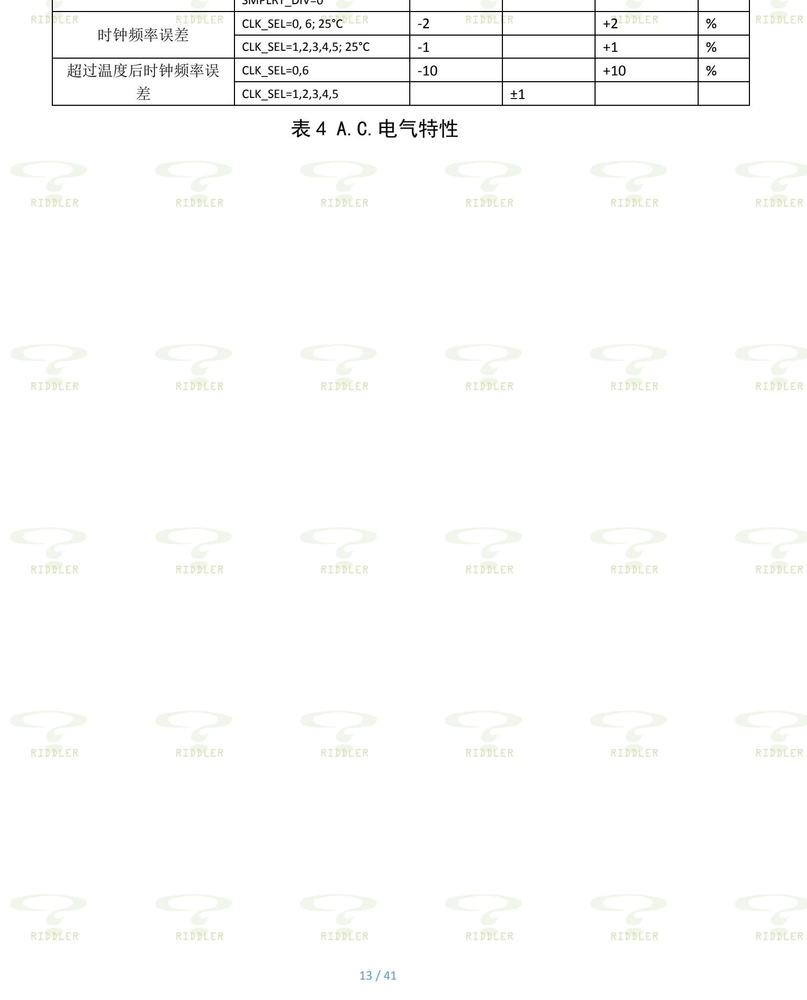

MPU-9250

中文资料技术手册版本号：V1.0翻译者：出迷者时间：12-23-14

## 3.4.3 其他特性

典型工作电路在 4.2 章节，VDD =2.5V， VDDIO=2.5V， $\mathsf { T } \mathsf { A } = 2 5 ^ { \circ } \mathrm { C }$ ，除非另外说明。

<table><tr><td>参数</td><td>条件</td><td>最小值</td><td>典型值</td><td>最大值</td><td>单位</td></tr><tr><td rowspan="2">SPI读取操作全部寄存器速率</td><td>低速读写</td><td></td><td>100±10%</td><td></td><td>KHz</td></tr><tr><td>高速读写</td><td></td><td>1 ±10%</td><td></td><td>MHz</td></tr><tr><td>SPI只读中断寄存器速率</td><td></td><td></td><td>20 ±10%</td><td></td><td>MHz</td></tr><tr><td rowspan="2">I2C操作频率</td><td>全寄存器,快速模式</td><td></td><td></td><td>400</td><td>KHz</td></tr><tr><td>全寄存器,标准模式</td><td></td><td></td><td>100</td><td>KHz</td></tr></table>

表 5 其他特性

<table><tr><td>InvenSense</td><td>MPU-9250</td><td>中文资料技术手册</td><td>版本号:V1.0翻译者:出迷者时间:12-23-14</td><td>RIDDER</td></tr></table>

## 3.5 I2C 时序特性

典型工作电路请参阅 4.2 章节，VDD =2.4-3.6V， VDDIO=1.7V-VDD，TA=25℃，除非另外说明。

<table><tr><td>参数</td><td>条件</td><td>最小值</td><td>典型值</td><td>最大值</td><td>单位</td><td>说明</td></tr><tr><td>I2C时序</td><td>I2C快速模式</td><td></td><td></td><td></td><td></td><td></td></tr><tr><td> $f_{SCL}$ SCLK时钟频率</td><td></td><td></td><td>RIDDLER</td><td>400</td><td>kHz</td><td></td></tr><tr><td> $t_{HD.STA}$ ,开始等待时间</td><td></td><td>0.6</td><td></td><td></td><td>μs</td><td></td></tr><tr><td> $t_{LOW}$ SCL低电平时长</td><td></td><td>1.3</td><td></td><td></td><td>μs</td><td></td></tr><tr><td> $t_{HIGH}$ SCL高电平时长</td><td></td><td>0.6</td><td></td><td></td><td>μs</td><td></td></tr><tr><td> $t_{SU.STA}$ 开始设置时间</td><td></td><td>0.6</td><td></td><td></td><td>μs</td><td></td></tr><tr><td> $t_{HD.DAT}$ SDA数据保持时长</td><td></td><td>0</td><td></td><td></td><td>μs</td><td></td></tr><tr><td> $t_{SU.DAT}$ SDA数据设置时长</td><td></td><td>100</td><td></td><td></td><td>ns</td><td></td></tr><tr><td> $t_{r}$ SDA SCL上升沿时间</td><td rowspan="2"> $c_b$ 总线电容值10-400pF</td><td rowspan="2">20+0.1Cb</td><td></td><td rowspan="2">300</td><td rowspan="2">ns</td><td></td></tr><tr><td> $t_{r}$ SDA SCL下降沿时间</td><td>RIDDLER</td><td></td></tr><tr><td> $t_{SU.STO}$ 停止设置时间</td><td></td><td>0.6</td><td></td><td></td><td>μs</td><td></td></tr><tr><td> $t_{BUF}$ 总线空余时间</td><td></td><td>1.3</td><td></td><td></td><td>μs</td><td></td></tr><tr><td> $C_b$ 各总线负载电容</td><td></td><td></td><td>&lt;400</td><td></td><td>pF</td><td></td></tr><tr><td> $t_{VD.DAT}$ 数据有效期</td><td></td><td></td><td></td><td>0.9</td><td>μs</td><td></td></tr><tr><td> $t_{VD.ACK}$ 数据确认时间</td><td></td><td></td><td></td><td>0.9</td><td>μs</td><td></td></tr></table>

表 6 I2C 时序特性

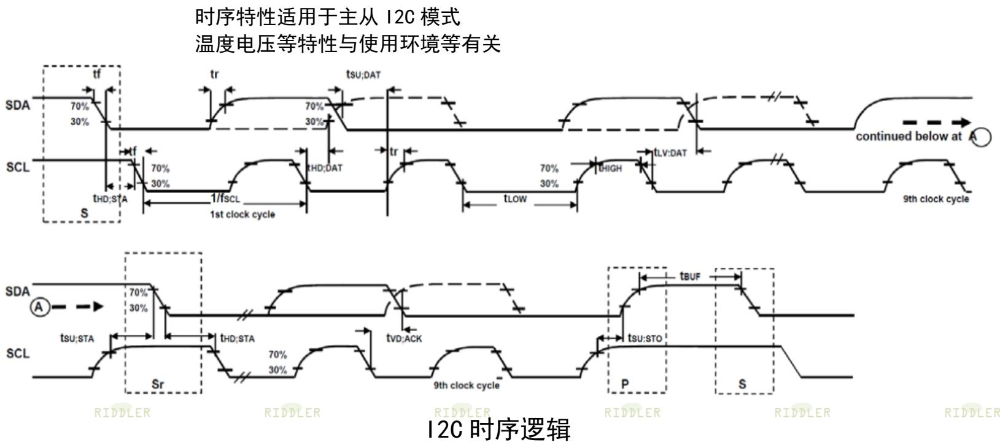

## 3.6 SPI 时序特性

典型工作电路在 4.2 章节，VDD =2.4-3.6V， VDDIO=1.7V-VDD，TA=25℃，除非另外说明。

<table><tr><td>参数</td><td>条件</td><td>最小值</td><td>典型值</td><td>最大值</td><td>单位</td><td>说明</td></tr><tr><td>SPI 时序</td><td></td><td></td><td></td><td></td><td></td><td></td></tr><tr><td> $f_{SCLK}$ SCLK 时钟频率</td><td></td><td></td><td></td><td>1</td><td>MHz</td><td></td></tr><tr><td> $t_{LOW}$ SCLK 低电平</td><td></td><td>400</td><td></td><td></td><td>ns</td><td></td></tr><tr><td> $t_{HIGH}$ SCLK 高电平</td><td></td><td>400</td><td></td><td></td><td>ns</td><td></td></tr><tr><td> $t_{SU.CS}$ CS 等待准备时间</td><td></td><td>8</td><td></td><td></td><td>ns</td><td></td></tr><tr><td> $t_{HD.CS}$ CS 持续等待时长</td><td></td><td>500</td><td></td><td></td><td>ns</td><td></td></tr><tr><td> $t_{SU.SDI}$ SDI 等待准备时长</td><td></td><td>11</td><td></td><td></td><td>ns</td><td></td></tr><tr><td> $t_{HD.SDI}$ SDI 持续等待时长</td><td></td><td>7</td><td></td><td></td><td>ns</td><td></td></tr><tr><td> $t_{VD.SDO}$ SOD 有效时长</td><td> $C_{load} = 20pF$ </td><td></td><td></td><td>100</td><td>ns</td><td></td></tr><tr><td> $t_{HD.SDO}$ SOD 持续时长</td><td> $C_{load} = 20pF$ </td><td>4</td><td></td><td></td><td>ns</td><td></td></tr><tr><td> $t_{DIS.SDO}$ SOD 无效输出时间</td><td></td><td></td><td></td><td>50</td><td>ns</td><td></td></tr></table>

表7 SPI时序特性

## 说明：

温度电压等特性与使用环境相关

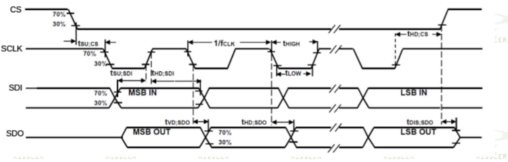  
SPI时序特性

## 3.6.1 fSCLK = 20MHz

<table><tr><td>参数</td><td>条件</td><td>最小值</td><td>典型值</td><td>最大值</td><td>单位</td></tr><tr><td>SPI 时序</td><td></td><td></td><td></td><td></td><td></td></tr><tr><td> $f_{SCLK}$ SCLK 时钟频率</td><td></td><td>0.9</td><td></td><td>20</td><td>MHz</td></tr><tr><td> $t_{LOW}$ SCLK 低电平</td><td></td><td>-</td><td></td><td>-</td><td>ns</td></tr><tr><td> $t_{HIGH}$ SCLK 高电平</td><td></td><td>-</td><td></td><td>-</td><td>ns</td></tr></table>

  
表 8 fCLK = 20MHz

MPU-9250

中文资料技术手册版本号：V1.0翻译者：出迷者时间：12-23-14

<table><tr><td>tsu.csCS 准备时长</td><td></td><td>1</td><td></td><td></td><td>ns</td></tr><tr><td>tHD.csCS 持留时间</td><td></td><td>1</td><td></td><td></td><td>ns</td></tr><tr><td>tsu.SDI SDI 准备时长</td><td></td><td>0</td><td></td><td></td><td>Ns</td></tr><tr><td>tHD.SDI SDI 持留时间</td><td></td><td>1</td><td></td><td></td><td>ns</td></tr><tr><td>tVD.SDO SDO 生效时间</td><td> $C_{load} = 20pF$ </td><td></td><td>25</td><td></td><td>ns</td></tr><tr><td>tdis.SDO SDO 无效输出</td><td></td><td></td><td></td><td>25</td><td>ns</td></tr></table>

## 说明：

## 1. 温度电压等特性还与使用环境有关

<table><tr><td>InvenSense</td><td>MPU-9250</td><td>中文资料技术手册</td><td>版本号:V1.0翻译者:出迷者时间:12-23-14</td><td>RIDDER</td></tr></table>

## 3.7 最大额定值

大于这些最大额定值很可能会造成芯片永久性损坏。并且在这种极限条件下很可能会毁坏芯片本身，更别说测到的准确数据了。

<table><tr><td>参数</td><td>符号</td><td>条件</td><td>最小值</td><td>最大值</td><td>单位</td></tr><tr><td rowspan="2">电压输入</td><td>VDD</td><td></td><td>-0.5</td><td>4.0</td><td>V</td></tr><tr><td>VDDIO</td><td></td><td>-0.5</td><td>4.0</td><td>V</td></tr><tr><td>加速度</td><td></td><td>全轴 0.2ms 持续时长</td><td></td><td>10,000</td><td>g</td></tr><tr><td rowspan="2">温度</td><td></td><td>工作</td><td>-40</td><td>105</td><td>°C</td></tr><tr><td></td><td>储能</td><td>-40</td><td>125</td><td>°C</td></tr><tr><td rowspan="2">静电耐压</td><td></td><td>人体放电</td><td>2</td><td></td><td>KV</td></tr><tr><td></td><td>电子设备放电</td><td>250</td><td></td><td>V</td></tr></table>

<table><tr><td>InvenSense</td><td>MPU-9250</td><td>中文资料技术手册</td><td>版本号:V1.0翻译者:出迷者时间:12-23-14</td><td>RIDDER</td></tr></table>

## 4 使用说明

## 4.1引脚功能说明

<table><tr><td>引脚号</td><td>引脚名</td><td>引脚功能</td></tr><tr><td>1</td><td>RESV</td><td>连接 VDDIO</td></tr><tr><td>7</td><td>AUX_CL</td><td>给从 I2C 设备提供主时钟</td></tr><tr><td>8</td><td>VDDIO</td><td>数字 I/O 口供压</td></tr><tr><td>9</td><td>ADO / SDO</td><td>I2C 从机 LSB(AD0)地址;SPI 串口数据输出(SDO)</td></tr><tr><td>10</td><td>REGOUT</td><td>调节器引脚,连接滤波电容</td></tr><tr><td>11</td><td>FSYNC</td><td>数字同步输入帧,若不用请接地</td></tr><tr><td>12</td><td>INT</td><td>中断数字输出</td></tr><tr><td>13</td><td>VDD</td><td>电压供给端</td></tr><tr><td>18</td><td>GND</td><td>地</td></tr><tr><td>19</td><td>RESV</td><td>啥都别接</td></tr><tr><td>20</td><td>RESV</td><td>接地</td></tr><tr><td>21</td><td>AUX_DA</td><td>连接其他 I2C 设备的主机数据口</td></tr><tr><td>22</td><td>nCS</td><td>片选</td></tr><tr><td>23</td><td>SCL / SCLK</td><td>I2C 模式下的 SCL SPI 模式下的 SCLK</td></tr><tr><td>24</td><td>SDA / SDI</td><td>I2C 模式下的 SDA SPI 模式下的 SDI</td></tr><tr><td>2-6, 14-17</td><td>NC</td><td>什么都别接</td></tr></table>

表9 引脚概述  
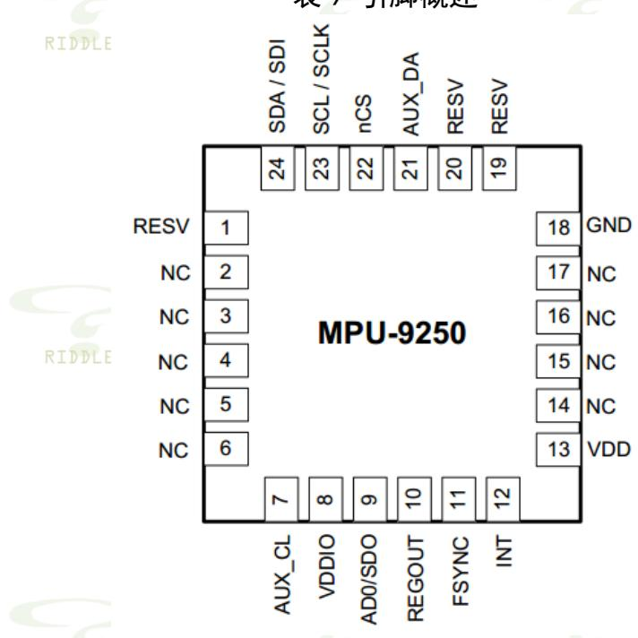  
图 1 QFN 封装 MPU9250

## InvenSense

版本号：V1.0翻译者：出迷者时间：12-23-14

## 4.2 典型电路

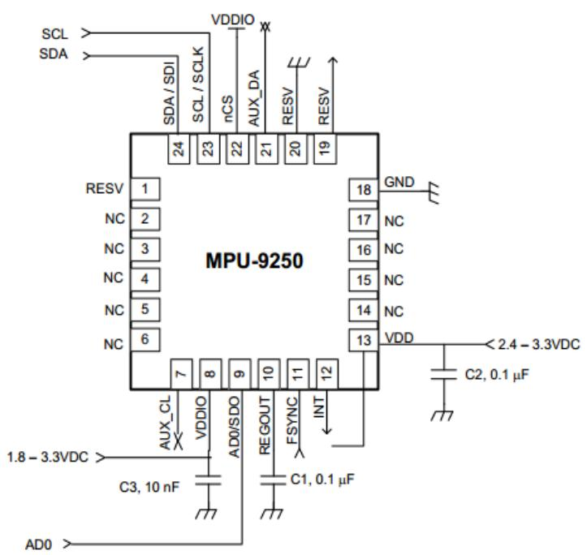

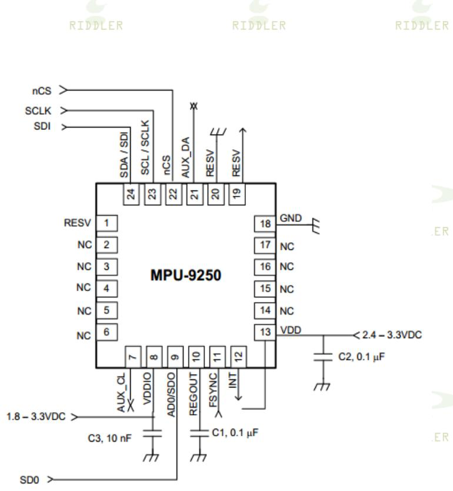  
图 2 MPU-9250 典型电路图：(a)I2C 模式(b)SPI 模式  
注意INT引脚应该接主控芯片的一个IO 引脚，以便中断唤醒系统

## 4.3周围电路元器件清单

<table><tr><td>元件</td><td>标号</td><td>规格</td><td>数量</td></tr><tr><td>滤波电容</td><td>C1</td><td>陶瓷, X7R, 0.1μF ±10%, 2V</td><td>1</td></tr><tr><td>VDD 旁路电容</td><td>C2</td><td>陶瓷, X7R, 0.1μF ±10%, V</td><td>1</td></tr><tr><td>VDDIO 旁路电容</td><td>C3</td><td>陶瓷, X7R, 10nF ±10%, 4V</td><td>1</td></tr></table>

表10 元器件清单

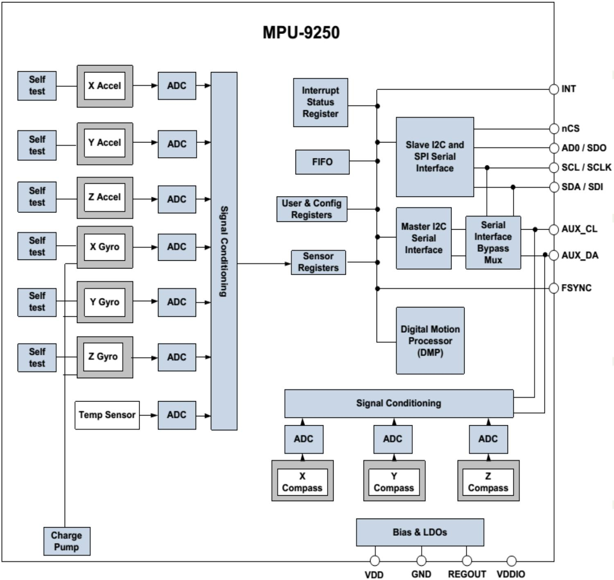

## 4.5 概述

## MPU-9250分为以下的模块和功能：

·16位 ADC三轴陀螺仪信号输出

·16位 ADC三轴加速度信号输出

·16位 ADC三轴磁力计信号输出

·运动数字处理引擎

·主 SPI 及 I2C 通信

·辅助 I2C芯片通信

·时钟方案

·数据寄存器

·FIFO 缓冲区

·中断功能

·温度数字输出

·9轴均可自我校准

·稳压偏置

·电荷泵

## 4.6 16位ADC三轴陀螺仪信号输出及调理

MPU-9250 陀螺仪是由三个独立检测 X,Y,Z 轴的 MEMS 组成。利用科里奥利效应来检测每个轴的转动（一但某个轴发生变化，相应的电容传感器会发生相应的变化，产生的信号被放大，调解，滤波，最后产生个与角速率成正比的电压，1000, or ±2000°/s）都可以被编程。ADC的采样速率也是可编程的，从每秒3.9-8000 个，用户还可选择是否使用低通滤波器来滤掉多余的杂波。

## 4.7 16位ADC三轴加速度信号输出及调理

MPU9250的三轴加速度也是单独分开测量的。根据每个轴上的电容来测量轴的偏差度。结构上降低了各种因素造成的测量偏差。当被置于平面上的时候，它会测出在 X 和 Y 轴上为 0g，Z 轴上为 1g 的重力加速度。加速度计的校准是根据工厂的标准来设定的，电源电压也许和你用的不一样。每一个传感器都有专门的 ADC来提供数字性的输出。输出的范围是通过编程可调的±2g, ±4g, ±8g, or ±16g

## 4.8 16位ADC三轴磁力计信号输出及调理

ER 三轴磁力计采用高精度的霍尔效应传感器，通过驱动电路， 信号放大和计算电路来处理信号来采集地磁场在 X，Y，Z轴上的电磁强度。每个 ADC 均可满量程（±

4800 µT）输出 16 位的数据。

## 4.9运动数字处理引擎（DMP）

运动数字处理引擎（DMP）位于 MPU9250 内部，可以直接处理数据，减少了主控芯片的任务。你只需要把所得到的加速度，陀螺仪，磁场值甚至外置的传感器的值直接给它即可。然后直接从他的寄存器读取计算好的值就行，或者直接把算好的值存入FIFO缓冲器。DMP有个中断引脚，可做来唤醒你的主控芯片。

DMP 主要是来释放你主芯片的工作任务。一般的运行速率达到 200Hz，可保证高速率和高精度。即使这样，主芯片在就算只有5Hz的速率下与其通信，芯片的运速度任然可以达到200Hz。DMP可以节能，而且对节约软件结构，节约程序运行时间还是非常重要的。

## 4.10 主 I2C 及 SPI 通信

MPU-9250 具有I2C和SPI通信的功能。当做从机通讯的时候，I2C 从机的地址的 LSB是由第9 引脚决定的，也就是AD0。

## 4.11 辅助 I2C 芯片通讯

MPU-9250 有个和辅助 I2C芯片通信的功能，这个功能有2 个模式:

## 辅助 I2C 总线运行模式：

I2C 主模式：允许 MPU-9250 直接读取传感器的寄存器，比如磁力计。在这个模式下，MPU-9250 可以不需要主控芯片而直接读取辅助芯片的寄存器。

例:在I2C 主模式下，MPU-9250可以设置成自己读取，然后返回如下的数据：

• X 轴 磁力计值（2字节）

• Y 轴 磁力计值（2字节）

• Z 轴 磁力计值（2字节）

I2C 主模式甚至可以被设置成从 4 个辅助传感器中读取 24 字节。大约有 1/5 的传感器都支持这种读写模式。

通行模式：让外部主控芯片做主机，直接控制辅助芯片（AUX\_DA 和AUX\_CL）和9250的通信。这种模式下，MPU250读取辅助芯片的功能不能再用了。AUX\_DA 和AUX\_CL现在是直接连接在 I2C总线上。

通行模式对于设置外部传感器还是非常重要的，甚至可以在不用 MPU9250的时候只让外部传感器工作，以降低 MPU9250 的功耗。并且还可以对 9250 进行数据操作。

通行模式还可以让主机直接访问 AK963 磁力计，这时 AK8963 作为从机的地址是0x0C

## 辅助I2C 总线的逻辑电平

对于MPU9250 来说，辅助 I2C的逻辑电平是 VDDIO提供的，如果想获取更多关于逻辑电平的信息，请参考 10.2章。

## 4.12 自检模式

如需知道更多关于自检的功能请参考寄存器说明书。

自检包括对物理部分和机械部分的自检。每个轴的自检测试可以由自检寄存器来启动（寄存器 13-16）。

自检的时候，传感器会产生一个信号。我们只需要读取这个信号就可以判断自检情况。

自检响应时长 = 传感器使能自检耗时 – 传感器不自检耗时

自检出的值只要在适当范围内，即视为通过。否则视为不通过。推荐用应美盛的自带软件检测。更多细节请关注应美盛官方说明。

## 4.13 MPU-250 I2C 通信解决方案

下图的方案是采用 MPU9250为主控芯片的I2C 通信来控制从机。对第三方芯片来说9250 是他的 I2C 主机。9250 作为 I2C 的主控有局限性，这要取决于系统对传感器的初始配置。I2C的 SDA 和 SCL 是复用口，主控芯片可以通过它直接和辅助传感器通信(AUX\_DA 和 AUX\_CL)。一旦辅助传感器被主控芯片配置，复用功能不能再用，但是主控芯片可以通过辅助 I2C 口读取到第三方芯片的数据。中断脚必须连接系统的 GPIO 引脚，这样我们就可以从唤醒系统。

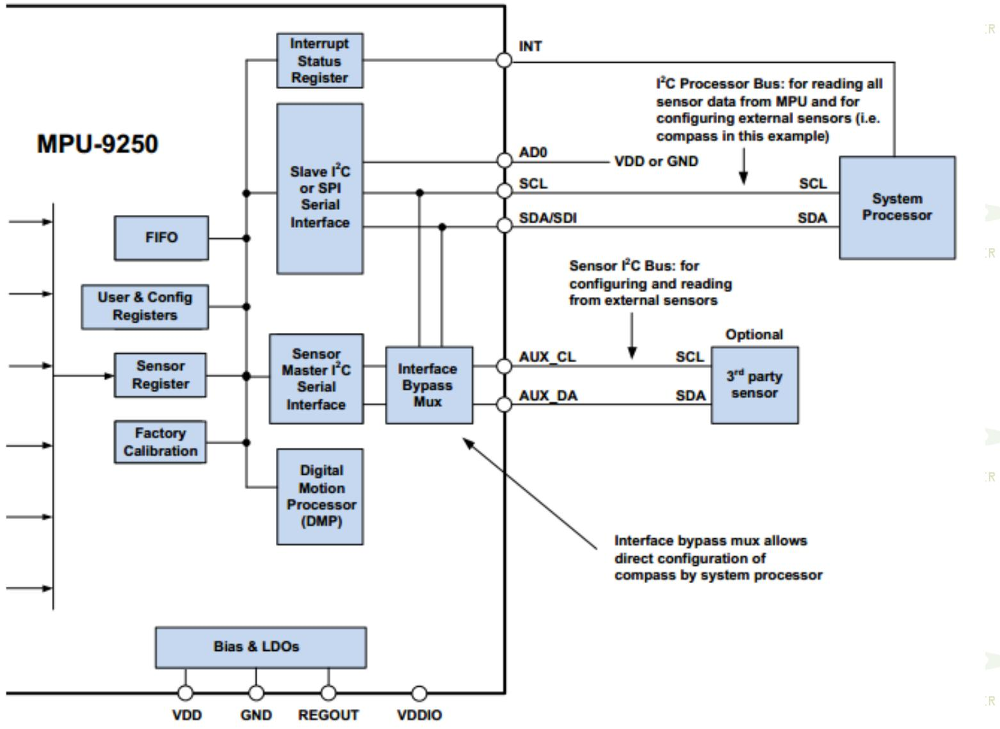

## 4.14 MPU-9250 SPI 通信解决方案

下图方案中，主控芯片是MPU-9250 的主机。SPI通信需要用到CS，SDO，SCLK 和 SDI信号。因为这些引脚有和 I2C的引脚冲突，所以在这个模式下，设备不能和辅助 I2C 设备通信。9250 作为I2C 的主控有局限性，这要取决于系统对传感器的初始配置。I2C的 SDA和 SCL是复用口，主控芯片可以通过它直接和辅助传感器通信(AUX\_DA和 AUX\_CL)。

当 MPU-9250 与主控芯片使用 SPI 通信的时候，可以通过 I2C 从机单字节读写配置辅助传感器。

一旦外部传感器被配置成功，MPU-9250 就可以通过 I2C 来进行单字节或多字节的配置了。读取的结果可以通过从机的 0-3控制器写入FIFO缓冲区

中断引脚INT建议与主控芯片连接，以便唤醒主芯片。

更多的细节请参阅寄存器文档。

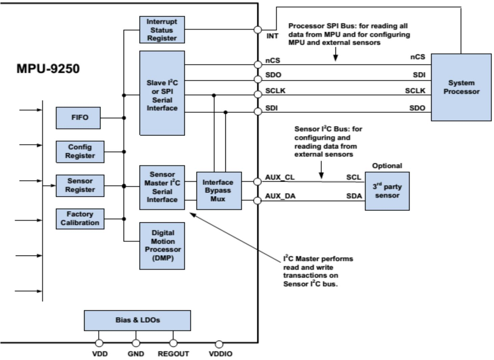

## 4.15 时钟方案

MPU-9250 有灵活的时钟方案，适用于各种内部时钟源同步电路。可以对信号进行信号调理

和模数转换器，DMP，以及各种控制电路和寄存器。片上PLL 允许各种输入的时钟信号。

兼容的内部时钟源信号：

·内部张弛振荡器

·X,Y,Z轴产生的振荡（过热会对 MEMS传感器的振荡器造成1%的误差）

供电量和时钟决定了内部振荡的频率，有可能会根据芯片运行方式而改变。 芯片运行的方式完全取决于你现在启用的芯片功能。举个例子，我们现在不管做什么都提倡低功耗，用户可以只开 DMP 功能计算加速度计而不开陀螺仪。这种情况下，我们就选择内部张弛振荡器来作为时钟信号。当然，在其他模式的情况下我们也可以去选择更为精准的陀螺仪振荡器来做时钟。

时钟的精准性对于距离和角度的计算影响是非常大的。（其他处理器亦是如此。）

当然，在初次使用传感器的时候，默认还是使用内部的时钟，除非你用程序后期配置。在MEMS在稳定之前还是一直用的都是内部的时钟。

## 4.16 数据寄存器

数据寄存器是只读寄存器，他们存放了刚刚被测量出来的加速度，陀螺仪，磁力计，辅助传感器以及温度的值。这些寄存器可以通过串行接口随时被访问。

## 4.17 FIFO 数据缓存区

MPU-9250 包含了一个容量有 512 字节的 FIFO 寄存器。FIFO 配置寄存器决定了哪些数据被写入了 FIFO 缓冲区。有可能是加速度值，陀螺仪的值，温度的值或辅助传感器的值，甚至FSYNC 引脚输入信号。有个叫 FIFO 计数器的家伙会负责记录 FIFO 里面的字节数量，而且你可以随时读它。这个中断功能是告诉你有新数据可以读了。更多的细节请参阅 MPU250 寄存器手册。

## 4.18 中断功能

中断的功能可以通过配置中断寄存器来配置。可配置的有：INT中断引脚配置，中断锁和清除以及中断触发。产生中断的情况有：

(1) 时钟振荡改变的时候（通常发生在切换时钟源时4发生）

(2) 有新数据可读的时候（FIFO寄存器内的数据）

(3) 加速度的中断功能（运动唤醒功能）

(4) 没有接收到辅助传感器数据的时候

中断的状态可以从中断寄存器中读取。

INT 引脚必须和主控芯片的相连以便唤醒休眠中的主机。更多细节请参阅寄存器手册。

版本号：V1.0翻译者：出迷者时间：12-23-14

## 4.19温度数字输出

这个传感器功能是用来检测 MPU9250的温度的。你可以从 FIFO缓冲区或者寄存器里面读取这个ADC的数值。

## 4.20 稳压偏置

芯片是通过自身的电压和电流来实现稳压和偏置的。他不受 VDD和 VDDIO 电平的影响，通过旁路电容来输出。更多细节请参阅寄存器手册。

## 4.21 电荷泵

产生振荡所需的高压所用。

## 4.22 标准供能方案

下表中我们给出了用户所有的供能方式。

<table><tr><td>方案</td><td>名称</td><td>陀螺仪</td><td>加速度</td><td>磁力计</td><td>DMP</td></tr><tr><td>1</td><td>休眠模式</td><td>关</td><td>关</td><td>关</td><td>关</td></tr><tr><td>2</td><td>待机模式</td><td>运行</td><td>关</td><td>关</td><td>关</td></tr><tr><td>3</td><td>低功耗加速度计模式</td><td>关</td><td>频宽比</td><td>关</td><td>开或关</td></tr><tr><td>4</td><td>低噪声加速度计模式</td><td>关</td><td>开</td><td>关</td><td>开或关</td></tr><tr><td>5</td><td>陀螺仪模式</td><td>开</td><td>关</td><td>关</td><td>开或关</td></tr><tr><td>6</td><td>磁力计模式</td><td>关</td><td>关</td><td>开</td><td>开或关</td></tr><tr><td>7</td><td>加速度+陀螺仪模式</td><td>开</td><td>开</td><td>关</td><td>开或关</td></tr><tr><td>8</td><td>加速度+磁力计模式</td><td>关</td><td>开</td><td>开</td><td>开或关</td></tr><tr><td>9</td><td>9轴模式</td><td>开</td><td>开</td><td>开</td><td>开或关</td></tr></table>

说明：

1. 模式的功率消耗在电气特性部分说明。

## 4.23 电源和复位规则

供电不得超过VDD和VDDIO，并且VDD和 VDDIO要求比较稳定。如表4 所示，VDD的最低上升时间是 最多是 毫秒。冷启动后 上升至稳定后 时，加速度计才能读到有效值。热启动则是 VDD 稳定后 30ms 即可读出有效数值。磁力计在冷启动 VDD 稳定后7.3ms才能读出有效数值。

## 5 硬件新技术

MPU-9250 的一些硬件的功能的启用与否可以通过简单的寄存器配置。这些功能最初使用时默认都是关闭的，然后你只需要简单的配置即可。以后上电即可使用，甚至都不需要主控芯片来控制。

低功耗的四元数算法（三轴陀螺仪或者6 轴陀螺仪+加速度）

安卓定位功能（低功耗下的屏幕旋转算法）

检测手势功能

计步器

运动检测功能

为了保证运动检测功能的使用，请将INT 口接在主控芯片的GPIO上，以便唤醒主控芯片。

说明：安卓的屏幕检测功能适用于安卓 4.0 版本

更多细节请参阅 MPU-9250寄存器说明书。

版本号：V1.0翻译者：出迷者时间：12-23-14

## 6 可编程中断

该系统的INT中断引脚可产生信号中断。状态标志位可以指示是谁产生的中断信号，中断信号也可以单独被开启和关闭。

## 中断源一览表

<table><tr><td>中断名</td><td>产生中断模块</td></tr><tr><td>运动检测</td><td>运动模块</td></tr><tr><td>FIFO 缓冲区溢出</td><td>FIFO</td></tr><tr><td>数据收发准备</td><td>传感器寄存器</td></tr><tr><td>I2C 主机错误,仲裁失败</td><td>I2C 主机</td></tr><tr><td>I2C Slave 4</td><td>I2C 主机</td></tr></table>

关于中断启动/关闭寄存器，标志寄存器等的相关信息，请参阅 MPU-9250的寄存器手册。一些寄存器的功能解释如下。

## 6.1运动唤醒中断

MPU-9250 具有运动检测功能。当传感器检测到比你设定值高的轴运动数值的时候就会发出中断。下面的框图将会告诉你，如何配置运动唤醒中断。更多关于寄存器的细节请参阅MPU—9250 寄存器手册。

请将INT引脚连接至主芯片的GPIO口，以便唤醒系统。

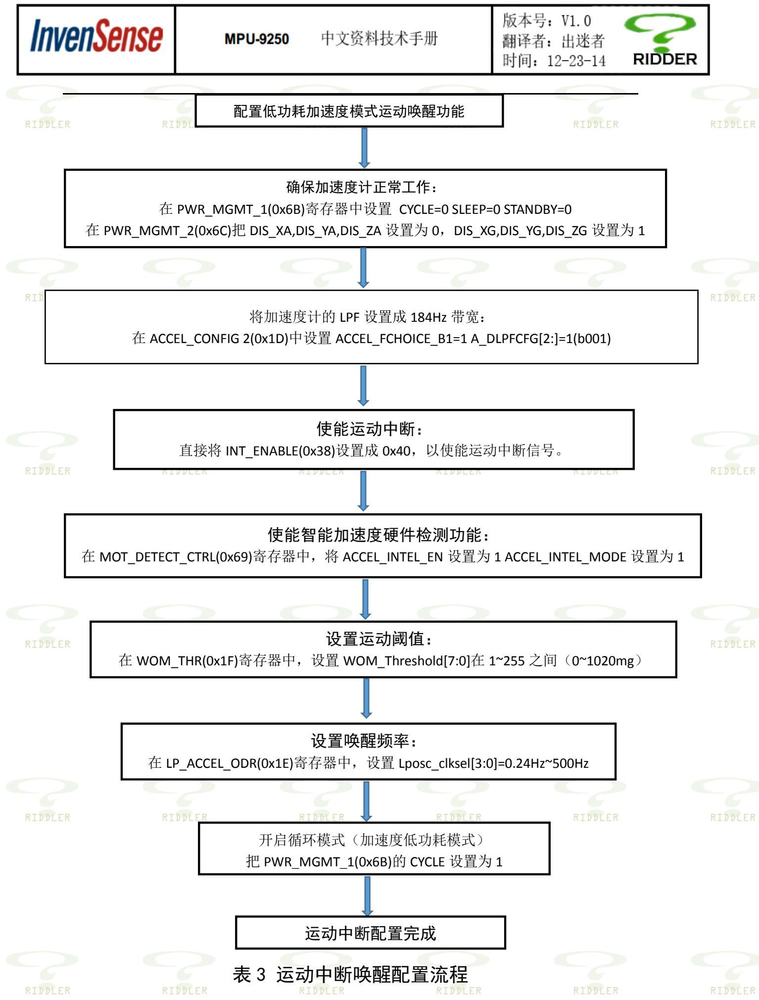

<table><tr><td>InvenSense</td><td>MPU-9250</td><td>中文资料技术手册</td><td>版本号:V1.0翻译者:出迷者时间:12-23-14</td><td>RIDDER</td></tr></table>

## 7 数字接口

## 7.1 I2C 和 SPI 接口

MPU—9250 的内部寄存器和储存器可以用 400KHz 的 I2C 或者 4 线模式在 1MHz 用 SPI 通讯。

## 接口引脚

<table><tr><td>引脚号</td><td>引脚名</td><td>引脚功能</td></tr><tr><td>8</td><td>VDDIO</td><td>数字 I/O 口提供电平</td></tr><tr><td>9</td><td>AD0/SD0</td><td>I2C 从机高位地址 LSB(AD0);SPI 串行输出(SD0)</td></tr><tr><td>23</td><td>SCL/SCLK</td><td>I2C 时钟(SCL);SPI 时钟(SCLK)</td></tr><tr><td>24</td><td>SDA/SDI</td><td>I2C 数据口(SDA);SPI 数据输入口(SDI)</td></tr></table>

说明：

为了防止从I2C 切换到 SPI模式，I2C 应该禁止设置 I2C\_IF\_DIS寄存器的配置位。此位应该在等待启动读写寄存器后立刻设置。

更多关于I2C\_IF\_DIS位的详细信息，请参阅 MPU-9250的寄存器手册。

## 7.2 I2C 通信

是一个双线通信方案，它有 和 两根线分别传输数据和时钟信号。通常这 个接口是双向的开漏极接口。在连接设备的时候可以做主机或者从机。从机在通讯时，通过地址即可匹配。

MPU-9250 通常和控制芯片连接时作为从机，SDA 和 SCL 通常需要上拉电阻到 VDD，最快通信速度达到400KHz。

MPU-9250 作为从机时的地址为 7 位 110100X（B）。这个地址的LSB 位由 AD0 引脚的电平确定，这样就使得一个系统中可以同时连接 2 个 MPU-9250 了。（AD0 为低电平时 X 为 0，高电平X则为1）。

## 7.3 I2C 通信协议

开始和停止条件

当主机将开始信号在 I2C总线上初始的时候，表明准备开始通信。开始信号即当 SDA 处在下降沿时，SCL 置高。而当SDA产生上升时，SCL置高，我们视作通讯停止信号。此外，除非再次出现开始信号或停止型号，否则总线一直通信。

<table><tr><td>InvenSense</td><td>MPU-9250</td><td>中文资料技术手册</td><td>版本号:V1.0翻译者:出迷者时间:12-23-14</td><td>RIDDER</td></tr></table>

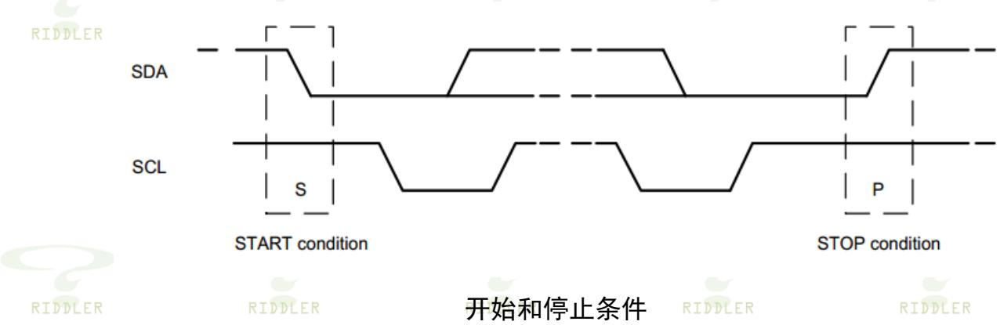  
数据传输规则

I2C每帧为8位数据位和1位（ACK）数据接收方应答位。应答位ACK 由从机负责拉低，从机在完整收到地址或数据后拉低 SDA数据总线，表示正确接收。当从机忙碌无法传送其他数据的时候它会吧 SCL拉低，直到有数据输出，释放总线。

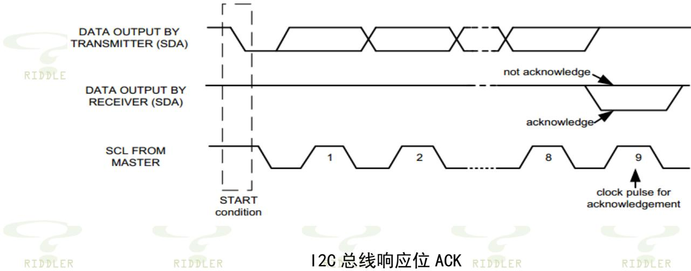

在开始信号发出后，主机开始发出 7个地址位和1个读写位。读写位决定了主从机的读写状态。然后主机释放SDA 线，等待从机的ACK应答信号。每次数据传输后必须跟一位读写位。从机应答即是拉低 SDA到SCL 高电平周期结束。当主机发出停止命令时，传输就会结束。然后主机重新发送开始信号继续和其他的I2C 设备通信。当SDA出现上升沿并且 SCL是高电平的时候，就表示停止信号。在通信时所有SDA信号的变化都是在 SCL低电平的时候。

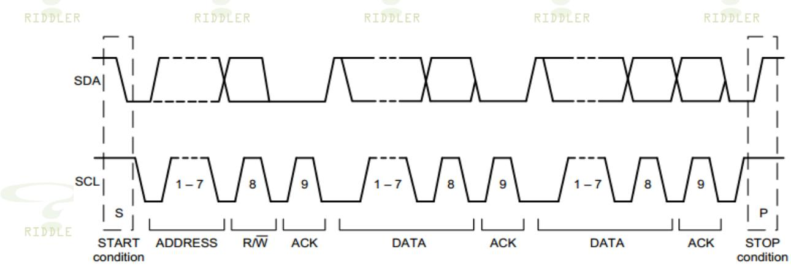

## I2C 时序

写 MPU250 的寄存器的方法：主机发送开始信号和从机的 7 个地址位再加上 1位的写入位。当在第 9 个时钟信号的时候，芯片产生应答。这时，主机输出寄存器地址，然后从机再次产生 ACK 应答，传输过程可以随时由停止信号停止。ACK 响应后，数据可以继续输入，除非没有产生停止位。芯片内部自带的递增寄存器可以自动将数据写入相应寄存。以下列出单字节和双字节的传输顺序。单字节传输

<table><tr><td>Master</td><td>S</td><td>AD+W</td><td></td><td>RA</td><td></td><td>DATA</td><td></td><td>P</td></tr><tr><td>Slave</td><td></td><td></td><td>ACK</td><td></td><td>ACK</td><td></td><td>ACK</td><td></td></tr></table>

多字节传输

<table><tr><td>Master</td><td>S</td><td>AD+W</td><td></td><td>RA</td><td></td><td>DATA</td><td></td><td>DATA</td><td></td><td>P</td></tr><tr><td>Slave</td><td></td><td></td><td>ACK</td><td></td><td>ACK</td><td></td><td>ACK</td><td></td><td>ACK</td><td></td></tr></table>

读MPU9250 的寄存器的方法：主机发送开始信号和从机的 7个地址位再加上读位。此时，寄存器地址变成可读模式。此时会收到 MPU9250 的返回信号 ACK，然后主机再次发送开始信号和地址，9250 此时会发回应答信号 ACK和数据。当主机发送 NACK 或停止位后通讯停止。NACK 信号就是第 9 个时钟脉冲 SDA 保持高电平。下图显示了单字节和双字节的读取时序。

单字节时序

<table><tr><td>Master</td><td>S</td><td>AD+W</td><td></td><td>RA</td><td></td><td>S</td><td>AD+R</td><td></td><td></td><td>NACK</td><td>P</td></tr><tr><td>Slave</td><td></td><td></td><td>ACK</td><td></td><td>ACK</td><td></td><td></td><td>ACK</td><td>DATA</td><td></td><td></td></tr></table>

多字节读取时序

<table><tr><td>Master</td><td>S</td><td>AD+W</td><td></td><td>RA</td><td></td><td>S</td><td>AD+R</td><td></td><td></td><td>ACK</td><td></td><td>NACK</td><td>P</td></tr><tr><td>Slave</td><td></td><td></td><td>ACK</td><td></td><td>ACK</td><td></td><td></td><td>ACK</td><td>DATA</td><td></td><td>DATA</td><td></td><td></td></tr></table>

## 7.4 I2C 符号说明

<table><tr><td>信号名称</td><td>作用</td></tr><tr><td>S</td><td>起使信号:当 SCL 处于高电平时 SDA 处于下降沿</td></tr><tr><td>AD</td><td>从机 I2C 地址</td></tr><tr><td>W</td><td>写位</td></tr><tr><td>R</td><td>读位</td></tr><tr><td>ACK</td><td>响应:SCL 高电平时 SDA 保持低电平</td></tr><tr><td>NACK</td><td>未响应:SDA 在第 9 个时钟周期保持高电平</td></tr><tr><td>RA</td><td>MPU9250 内部寄存器</td></tr><tr><td>DATA</td><td>发送或接受位</td></tr><tr><td>P</td><td>停止信号:SCL 置高时 SDA 产生上升沿</td></tr></table>

## 7.5 SPI 通讯协议

SPI是4线同步串口通讯方式，包含两根控制线和两根数据线。当于主控芯片通信的时候，MPU9250 总是作为从机工作。

主机和从机在通讯时 SCLK，SDO,SDI 设备是共享的，每个从机和主机在通信的时候都需要单独的（CS）片选。

CS脚置低的时候表示被选中，置高表示没有选中。每次通信同时只允许一个CS脚被选中，以免占用总线。未被选择的芯片 都为高，此时他们都是高阻态，以免设备相互之间的干扰。

## SPI使用特性

1. 数据传输时MSB为首位，LSB 为末位。

2. SCLK 上升沿数据锁存。

3. SCLK 下降沿数据变化。

4. SCLK 最大频率是 1MHz

5. SPI读写操作在16个周期之内完成（多字节更多）。首字节发送SPI 地址，然后SPI数据。第一个字节的第一个位表示读（1）写（0）功能。然后发送的7 个位是寄存器地址。在多字节读取的情况下，传输的数据 2 个或更多字节。

SPI地址位格式

<table><tr><td>MSB</td><td></td><td></td><td></td><td></td><td></td><td></td><td>LSB</td></tr><tr><td>R/W</td><td>A6</td><td>A5</td><td>A4</td><td>A3</td><td>A2</td><td>A1</td><td>A0</td></tr></table>

<table><tr><td>MSB</td><td></td><td></td><td></td><td></td><td></td><td></td><td>LSB</td></tr><tr><td>D7</td><td>D6</td><td>D5</td><td>D4</td><td>D3</td><td>D2</td><td>D1</td><td>D0</td></tr></table>

6. 支持单独或突发读写模式

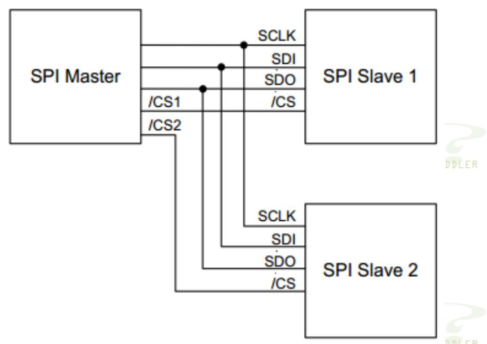  
典型SPI/主从机连接方案

## 8 串行接口

## 8.1 I2C 使用方案

MPU-9250 支持与主控芯片和辅助传感器通过 I2C通信。

MPU-9250 的 I/O 电平既是 VDDIO 引脚电平。

下图即是和主控芯片和辅助传感器的通信方案，表明一下之间的关系。

说明：实际连接方式还去决定于辅助芯片。

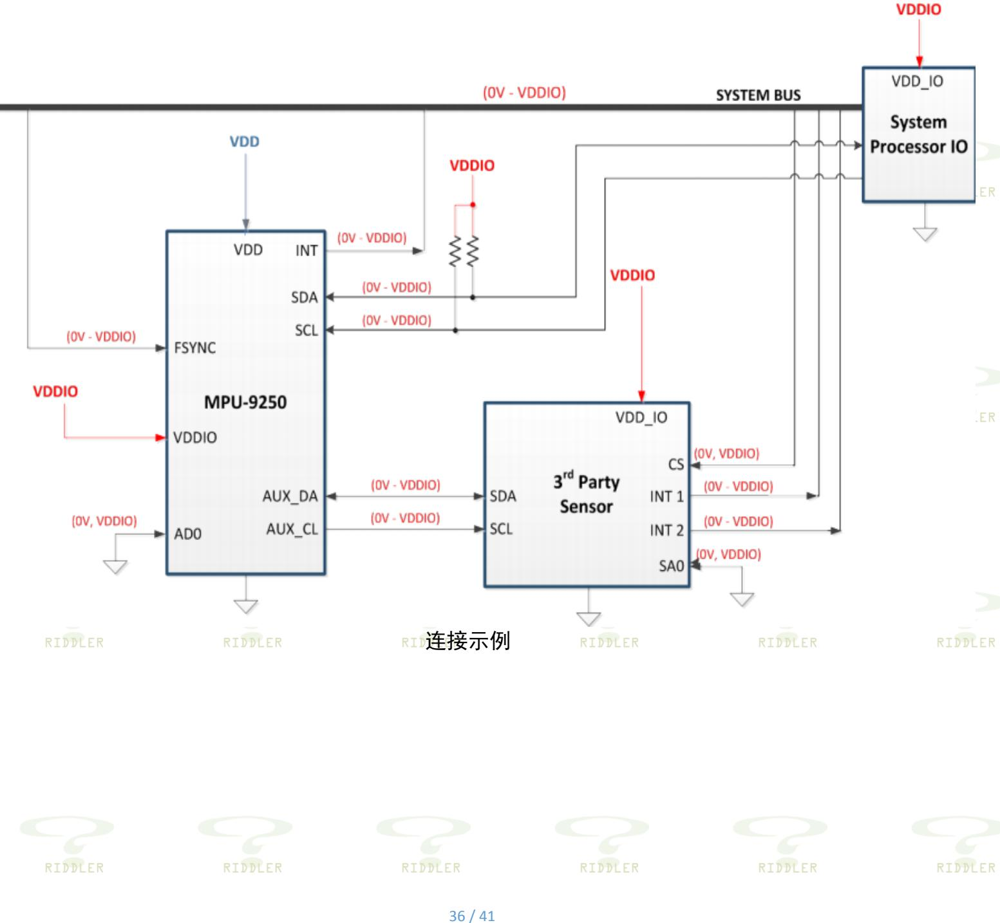

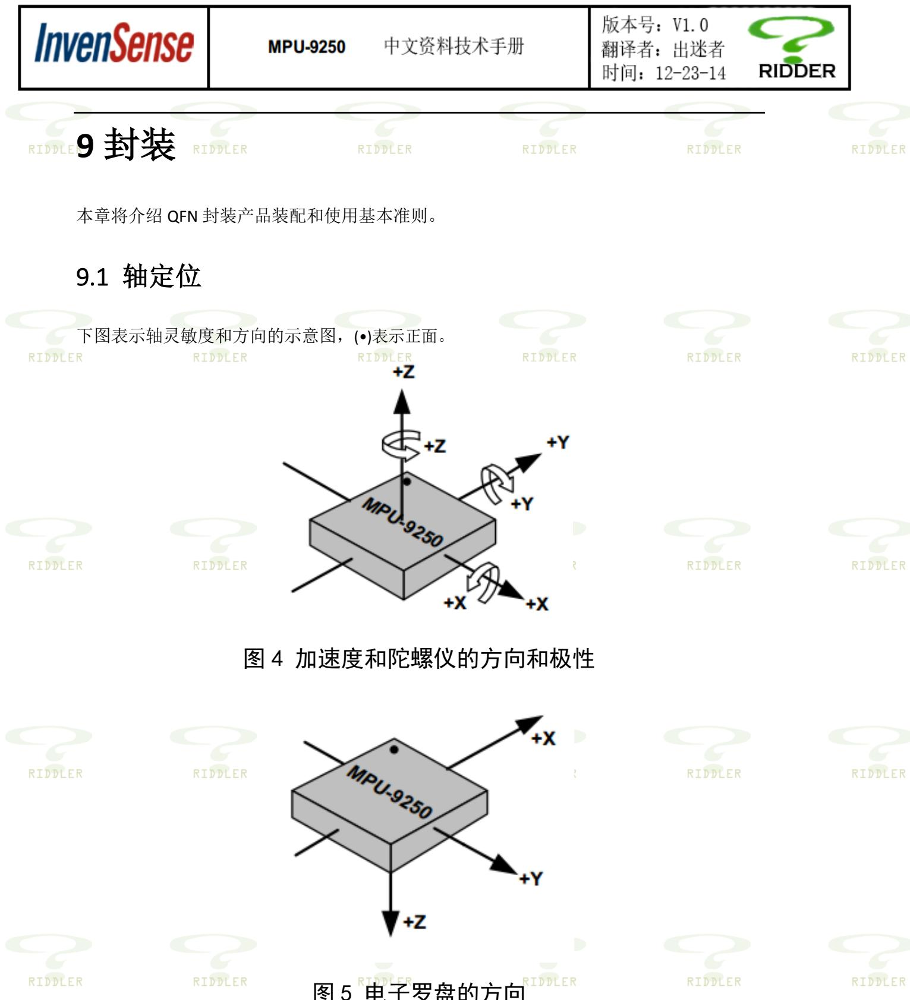

<table><tr><td>InvenSense</td><td>MPU-9250</td><td>中文资料技术手册</td><td>版本号:V1.0翻译者:出迷者时间:12-23-14</td><td>RIDDER</td></tr></table>

## 9 封装

本章将介绍QFN封装产品装配和使用基本准则。

## 9.1 轴定位

下图表示轴灵敏度和方向的示意图，(•)表示正面。

图5 电子罗盘的方向

## 9.2 封装尺寸

24 引脚 QFN（3x3x1）mm 镍钯金引线框架（引线框架作为集成电路的芯片载体，

是一种借助于键合金丝实现芯片内部电路引出端与外引线的电气连接，形成电气回路的关键结构件，它起到了和外部导线连接的桥梁作用，绝大部分的半导体集成块中都需要使用引线框架，是电子信息产业中重要的基础材料。产品类型有 TO、DIP、ZIP、SIP、SOP、SSOP、QFP（QFJ）、SOD、SOT 等。主要用模具冲压

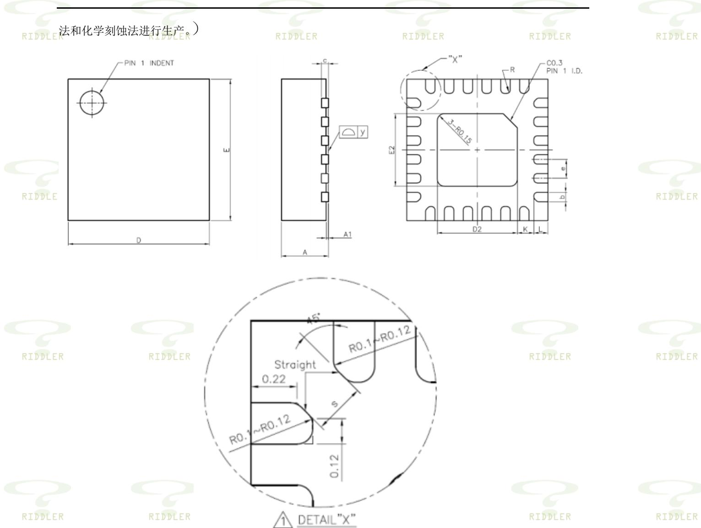

<table><tr><td rowspan="2">符号</td><td rowspan="2">名称</td><td colspan="3">规格(mm)</td></tr><tr><td>最小值</td><td>正常值</td><td>最大值</td></tr><tr><td>A</td><td>封装厚度</td><td>0.95</td><td>1.00</td><td>1.05</td></tr><tr><td>A1</td><td>引脚高度</td><td>0.00</td><td>0.02</td><td>0.05</td></tr><tr><td>b</td><td>引脚宽度</td><td>0.15</td><td>0.20</td><td>0.25</td></tr><tr><td>c</td><td>引脚高度</td><td>----</td><td>0.15REF</td><td>----</td></tr><tr><td>D</td><td>封装宽度</td><td>2.90</td><td>3.00</td><td>3.10</td></tr><tr><td>D2</td><td>裸露焊点宽度</td><td>1.65</td><td>1.70</td><td>1.75</td></tr><tr><td>E</td><td>封装长度</td><td>2.90</td><td>3.00</td><td>3.10</td></tr><tr><td>E2</td><td>裸露焊点长度</td><td>1.49</td><td>1.54</td><td>1.59</td></tr><tr><td>e</td><td>引脚到引脚</td><td>----</td><td>0.40</td><td>----</td></tr><tr><td>f(e-b)</td><td>引脚宽度</td><td>0.15</td><td>0.20</td><td>0.25</td></tr><tr><td>K</td><td>引脚到裸露点</td><td>----</td><td>0.35REF</td><td>----</td></tr><tr><td>L</td><td>引脚长度</td><td>0.25</td><td>0.30</td><td>0.35</td></tr><tr><td>R</td><td>引脚边半径</td><td>0.075</td><td>REF</td><td>----</td></tr></table>

<table><tr><td>InvenSense</td><td>MPU-9250</td><td>中文资料技术手册</td><td>版本号:V1.0翻译者:出迷者时间:12-23-14</td><td></td></tr></table>

<table><tr><td rowspan="2">s</td><td rowspan="2">边缘引脚半径距离</td><td>----</td><td>0.25REF</td><td>----</td></tr><tr><td>RIDDLER</td><td>RIDDLER</td><td>RIDDLER</td></tr><tr><td>y</td><td></td><td>0.00</td><td>----</td><td>0.075</td></tr></table>

## 10 封装号

MPU9250 的封装号如下：

<table><tr><td>名称</td><td>封装名</td></tr><tr><td>MPU-9250</td><td>MP92</td></tr></table>

<table><tr><td>InvenSense</td><td>MPU-9250</td><td>中文资料技术手册</td><td>版本号:V1.0翻译者:出迷者时间:12-23-14</td><td>RIDDER</td></tr></table>

## 11 产品测试

## 11.1质量测试标准

InvenSense 的产品在投入量产之前都是经过严格测试的。MPU9250 完全符合 JEDEC JESD 471标准.。下表描述的是各项指标的测试方案。

## 11.2 测试方案

加速度计使用寿命测试

<table><tr><td>测试内容</td><td>测试方法</td><td>抽样数</td><td>样品</td><td>不符合标准</td></tr><tr><td>高温环境运行寿命</td><td>JEDEC JESD22-A108DDynamic, 3.63V biased, Tj&gt;125°C[read-points: 168, 500, 1000 hours]</td><td>3</td><td>77</td><td>(0/1)</td></tr><tr><td>超高加速度测试</td><td>JEDEC JESD22-A118ACondition A, 130°C, 85%RH, 33.3 psia., unbiased[read-point: 96 hours]</td><td>3</td><td>77</td><td>(0/1)</td></tr><tr><td>高温运行时长</td><td>JEDEC JESD22-A103DCondition A, 125°C Non-Bias Bake[read-points: 168, 500, 1000 hours]</td><td>3</td><td>77</td><td>(0/1)</td></tr></table>

各组件测试

<table><tr><td>测试内容</td><td>测试方法</td><td>抽样数</td><td>样品</td><td>不合格</td></tr><tr><td>人体静电放电</td><td>JEDEC JS-001 -2012(2KV)</td><td>1</td><td>3</td><td>(0/1)</td></tr><tr><td>机械静电放电</td><td>JEDEC JESD22-A115C(250V)</td><td>1</td><td>3</td><td>(0/1)</td></tr><tr><td>带静电器件模拟</td><td>JEDEC JESD22-C101E(500V)</td><td>1</td><td>3</td><td>(0/1)</td></tr><tr><td>锁定</td><td>JEDEC JESD-78D Class II (2), 125°C; ±100mA 1.5X Vdd Over-voltage</td><td>1</td><td>6</td><td>(0/1)</td></tr><tr><td>机械震动</td><td>JEDEC JESD22-B104C, Mil-Std-883, Method 2002.5 Cond. E, 10,000g&#x27;s, 0.2ms, ±X, Y, Z-6 directions, 5 times/direction</td><td>3</td><td>5</td><td>(0/1)</td></tr><tr><td>摆动</td><td>JEDEC JESD22-B103B Variable Frequency (random), Cond. B, 5-500Hz, X, Y, Z-4 times/direction</td><td>1</td><td>5</td><td>(0/1)</td></tr><tr><td>温度循环</td><td>JEDEC JESD22-A104D Condition G [-40°C to +125°C], Soak Mode 2 [5&#x27;] [read-Point: 1000 cycles]</td><td>3</td><td>77</td><td>(0/1)</td></tr></table>

（1）测试使用的是 JEDEC JESD22-A113F 标准

  
回流焊规范  
静电释放（ESD）

版本号：V1.0翻译者：出迷者时间：12-23-14

## 12 参考说明

要想取得以下的信息，请参考一下 InvenSense MEMS 应用手册(AN-IVS-0002A-00)。

•制造建议

装配指南及建议

PCB 设计指南及建议

MEMS 操作指令

存储规则

包装标识规范

卷轴带规范

标签

包装

航运标签

•硬性标准绿色环保符合设计检查规范 DRC符合免责声明

本文档所有测试内容可靠准确的，在不侵犯InvenSense 的利益和权利下，第三方使用者享有使用权。若产品后又变更，赎不另行通知。若在使用中出现问题造成损失，InvenSense不承担任何赔付责任。但不限于对专利，版权等支持产权的侵害。

InvenSense 专利受保护，不得在未批准的情况下使用 InvenSense 的专利技术。注册商标也是公司财产，不得造成公司名誉损害。InvenSense 公司的产品不得用于制造大规模杀伤性武器，或任何用于威胁他人生命的武器，或者任何与生命相关的医疗设备。运输，航天，核能，海底设备，电站设备，灾害预防，预防犯罪等设备。

© 2014 InvenSense, Inc. 版 权 所 有 . InvenSense, MotionTracking, MotionProcessing, MotionProcessor,MotionFusion, MotionApps, DMP, 以及 InvenSense 标识属 InvenSense 所有, Inc. 其他商标可能是公司关联商标。

©201 4 InvenSense, Inc.公司保持所有权利

