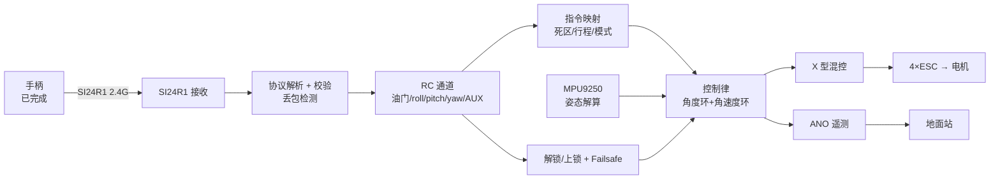
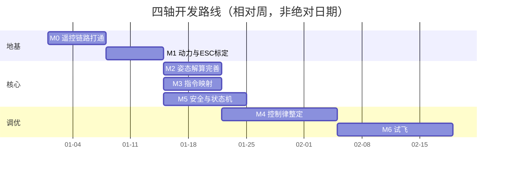

# DragonFly V2 四轴飞控开发计划

> 目标：手柄（已完成）→ SI24R1 → 四轴，实现**姿态自稳飞行**。
> 本文档基于当前仓库代码实际状态编写，随开发进度更新。

---

## 0. 现状盘点（基于当前代码）

| 模块 | 文件 | 状态 | 说明 |
|------|------|------|------|
| 时钟 / HAL | `Core/Src/main.c` | ✅ 完成 | HSI → PLL 100 MHz |
| 电机 PWM | `Modules/Motor` + `Core/Src/tim.c` | ✅ 完成 | TIM3 4 通道，PSC=249/ARR=999 → **400 Hz**（周期 2500 μs） |
| MPU9250 | `Modules/IMU` | ⚠️ 可用 | 互补滤波，roll/pitch 可自稳，**yaw 纯陀螺积分会漂** |
| PID + 混控 | `Modules/Control` | ⚠️ 待完善 | X 型混控已有，但 **yaw 用角度环**（应为角速度环），参数未整定 |
| 系统状态机 | `Modules/System` | ⚠️ 空壳 | 枚举已定义，**无状态迁移、无解锁逻辑** |
| 串口命令台 | `Modules/Comm` | ✅ 完成 | UART1 命令：`INFO/MODE/LED/MOTOR` |
| 匿名数传 | `Modules/ANO` | ✅ 发送 | 仅上报，不回传遥控 |
| SI24R1 驱动 | `Modules/SI24R1` | ⚠️ 未接入 | init/send/recv 已实现，**没有任何任务调用 `SI24R1_ReceivePacket`** |
| 遥控数据结构 | `Modules/Comm/Inc/comm.h` | ⚠️ 空壳 | `RC_Data_t g_rcData` 已定义，**从未被填充** |
| 遥控→控制链路 | — | ❌ 缺失 | `Control_SetTarget()` **从未被调用** |

**一句话结论：驱动层基本齐了，缺的是「通信接入 → 指令映射 → 安全逻辑 → 整定试飞」这条应用链。**

---

## 1. 系统数据流



---

## 2. 建议的任务划分（FreeRTOS）

当前 `Core/Src/freertos.c` 里 4 个任务有 3 个是 `osPriorityIdle`，接收/控制必须提优先级。

| 任务 | 频率 | 建议优先级 | 栈 | 职责 |
|------|------|-----------|----|------|
| `StartDefaultTask` | 1 kHz | Normal+（高） | 256 | `System_Update` → `IMU_Update` → 指令映射 → `Control_Update` |
| **RC 接收任务（新增）** | 500 Hz~1 kHz | High | 256 | `SI24R1_ReceivePacket` → 解析 → 写 `g_rcData` |
| 串口命令台 `myTask03` | 事件 | Low | 256 | 调参 / 调试命令（避免与遥控抢时间） |
| 遥测 `myTask04` | 50~100 Hz | Low | 256 | `ANO_DT_Data_Exchange` |
| LED `myTask02` | 10 Hz | Low | 128 | 状态指示 |

> ⚠️ 关键：**1 ms 控制环里不能有阻塞调用**。当前 `SI24R1_SendPacket` 内部用了 `HAL_Delay(1)`（阻塞 1 ms），接收任务里要避免；`IMU_Update` 用阻塞式 I2C 读 14 字节，需实测耗时。

---

## 3. 里程碑（按优先级 / 依赖排序）

### M0 · 打通遥控链路 🔴 最高优先
**为什么先做**：手柄已就绪，链路不通后面全是空谈；这是整个项目的地基。

- [ ] **确认手柄实际协议**（不要照抄教程示例，以手柄代码为准）
  - 帧头、通道字节序、量程（1000–2000？）、CRC 类型、有无帧序号
  - 教程里的**参考格式**（第 8.1 节）：
    ```
    Byte 0-1 : 帧头 0xAA 0x55
    Byte 2-3 : Throttle
    Byte 4-5 : Roll
    Byte 6-7 : Pitch
    Byte 8-9 : Yaw
    Byte 10-13: AUX1-4
    Byte 30-31: CRC16
    ```
- [ ] 新增 `Modules/RC`（或扩展 `Comm`）：
  - `SI24R1_RxTask()`：轮询 `SI24R1_ReceivePacket` → 校验 → 解析 → 填充 `g_rcData`
  - 加**帧序号 / 时间戳**，用于丢包统计与 Failsafe 判据
- [ ] 串口打印 8 通道实时值，摇杆验证
- [ ] **验收**：摇杆动作 → 串口数值同步变化；丢包率 < 1%；失联可检测

**涉及文件**：`Modules/SI24R1/*`、新增 `Modules/RC/*`、`Core/Src/freertos.c`

---

### M1 · 动力链路与 ESC 标定 🔴 高优先
**为什么靠前**：电机/电调必须先能安全、可重复地控制，才能上桨试飞。

- [ ] **统一油门量纲**：当前 `Motor_SetDuty` 是 0–999 占空比，400 Hz 下对应 0–2500 μs。
  - 标准 ESC 需要 **1000–2000 μs** → 即 duty **400–800**
  - 建议加一层 `Motor_SetThrottle(1000..2000)` 做映射，避免混控里出现"物理脉冲宽度"魔法数
- [ ] ESC 行程标定（上电全油门 → 收最低，按电调说明书）
- [ ] 怠速 / 停转逻辑（`MOTOR_PWM_IDLE` 当前 50，需实测确定安全怠速）
- [ ] **核对电机编号、转向与 X 型混控符号**（`control.c` 中 m1..m4 的正负号）
  - 拆桨实测：单独加油门确认电机序号；确认对角同向
- [ ] **验收**：单电机油门线性；混控方向正确（倾斜时对应电机增速）

**涉及文件**：`Modules/Motor/*`、`Modules/Control/Src/control.c`

---

### M2 · 姿态解算完善 🟠 中高优先
- [ ] **加速度计水平校准**：消除安装倾斜偏差（平放采集均值做零位）
- [ ] 传感器健康检查：`WHO_AM_I`、I2C 超时返回值的处理（当前 `IMU_Update` 失败直接 return，会静默丢失一帧）
- [ ] **yaw 漂移问题二选一**：
  - 方案 A：启用 MPU9250 内置 AK8963 磁力计（`REG_INT_PIN_CFG=0x02` BYPASS_EN 当前被注释），做 9 轴融合
  - 方案 B：接受漂移，遥控 yaw 用**角速度模式**（绝大多数飞控默认如此），航向不锁
- [ ] 融合算法：互补滤波 → **Mahony / Madgwick**（可选，效果更好）
- [ ] 实测 `IMU_Update` 单次耗时，确认 1 kHz 内有余量
- [ ] **验收**：静止 30 min 无明显漂移；快速晃动角度跟随无滞后；roll/pitch 静态误差 < 1°

**涉及文件**：`Modules/IMU/Src/imu.c`

---

### M3 · 遥控 → 控制指令映射 🔴 高优先
**这是当前最大的空缺**：`Control_SetTarget()` 从没被调用过。

- [ ] 新增映射层（建议放 `Modules/Control` 或 `Modules/RC`）：
  - 油门 → `throttleTarget`（注意量纲统一到 M1 的结果）
  - roll/pitch → 角度目标（自稳模式）或角速度目标（手动模式）
  - yaw → **角速度目标**（务必，别用角度）
- [ ] 摇杆**死区**、行程标定、可选指数曲线
- [ ] AUX 通道 → 飞行模式切换（自稳 / 手动 / 后续定高）
- [ ] **验收**：拆桨地面测试，各摇杆 → 目标值/电机响应对应正确

**涉及文件**：`Modules/Control/*`、`Modules/RC/*`

---

### M4 · 控制律完善与参数整定 🟠 中高优先
- [ ] 推荐**串级 PID**：外环角度（P）→ 内环角速度（PID）；至少先把 yaw 改成角速度环
- [ ] 积分限幅 / 抗饱和、微分项滤波、**实测 dt**（`osDelay(1)` 并不精确，别硬编码 0.001）
- [ ] 油门补偿 / 混控限幅策略
- [ ] 串口**在线调参**（`PID ROLL p i d`），参数存 Flash
- [ ] **验收**：地面阶跃响应收敛无振荡；能稳定悬停

**涉及文件**：`Modules/Control/*`、`Modules/Comm/Src/comm.c`

---

### M5 · 安全与状态机 🔴 高优先（可并行于 M3/M4）
- [ ] 实现状态迁移 `INIT → STANDBY → ARMED → FLYING`（当前只停在 STANDBY）
- [ ] **解锁/上锁**：油门最低 + 摇杆组合（或 AUX 开关）
- [ ] **Failsafe**：失联 > 200 ms → 缓降 / 停桨（配合 M0 的时间戳）
- [ ] 低电压报警：ADC 电池监测（`SystemInfo.batteryVoltage` 已预留但无 ADC）
- [ ] LED 状态指示：待机 / 已解锁 / 失控 / 低电
- [ ] **验收**：每一项保护都能人为复现（拔电、关手柄等）

**涉及文件**：`Modules/System/*`、`Modules/Comm/Src/comm.c`、`Core/Src/freertos.c`

---

### M6 · 试飞与调参 🟡 收尾
- [ ] 台架测试（固定机身，只测响应）
- [ ] 系留试飞 → 低空 → 悬停
- [ ] PID 整定顺序：P（roll/pitch）→ D → I → yaw
- [ ] 用 ANO 遥测看波形辅助调参
- [ ] **验收**：稳定悬停 ≥ 30 s，能修正外力扰动

---

### M7 · 进阶（可选，二期）
- [ ] `Docs/SPL06` 气压计 → 定高
- [ ] 磁力计融合锁航向
- [ ] 一键起飞 / 降落 / 返航
- [ ] 遥控链路双向遥测（回传电量/状态给手柄）

---

## 4. 依赖关系与建议时间线



> M2 / M3 / M5 可并行；M4 强依赖 M3（没有指令输入没法整定）。

---

## 5. 需要你确认的关键问题

1. **手柄数据包的真实格式**是什么？和 `Docs/SI24R1` 第 8.1 节的示例一致吗？（最好把发送端代码发我）
2. **电调型号**？当前 400 Hz PWM 是否兼容（多数现代电调支持，老式电调只认 50 Hz）？
3. **是否要磁力计锁航向**？否则 yaw 只能做角速度控制，会缓慢漂移。
4. **首选飞行模式**：自稳（角度）为主，还是手动（角速度）为主？
5. **电池监测硬件**是否已有（分压电阻接到哪个 ADC 引脚）？

---

## 6. 已知风险 / 技术债

| 项 | 位置 | 说明 |
|----|------|------|
| 帧格式未验证 | `Modules/ANO/Src/ANO_DT.c` | `send_senser` 等标志被读但未见发送分支，需核对 |
| DPL 配置混用 | `Modules/SI24R1/Src/si24r1.c` | 使能了动态长度（`DYNPD`/`FEATURE`），但接收按固定 32 字节读，**建议二选一**，否则长度校验会出问题 |
| 阻塞延时 | `SI24R1_SendPacket` | `HAL_Delay(1)` 在 RTOS 任务中会阻塞 1 ms，飞控侧发送要谨慎 |
| I2C 阻塞读 | `imu.c` | 1 kHz 环内阻塞读 14 字节，需实测耗时；必要时改 DMA |
| 任务优先级 | `freertos.c` | `myTask02/03/04` 均为 `osPriorityIdle`，接收任务必须提优先级 |
| dt 硬编码 | `imu.c` / `control.c` | `osDelay(1)` 抖动会使 `dt=0.001` 不准，建议实测 |
| 代码整洁 | `imu.c` 第 6 行 | `extern I2C_HandleTypeDef hi2c1;` 重复写了两遍 |
| 电源噪声 | 硬件 | 电机电调对 I2C/SPI 干扰，注意走线与滤波 |

---

## 7. 下一步（立刻可做的三件事）

1. **把手柄发送端代码给我**，我据此实现 M0 的接收解析任务。
2. 确认问题 2~4，我把 M1 的电机映射和 M3 的指令映射代码写出来。
3. 若想先看到效果，可先用串口命令台 `MOTOR ALL <d1> <d2> <d3> <d4>` 验证电机与转向（**务必拆桨**）。
